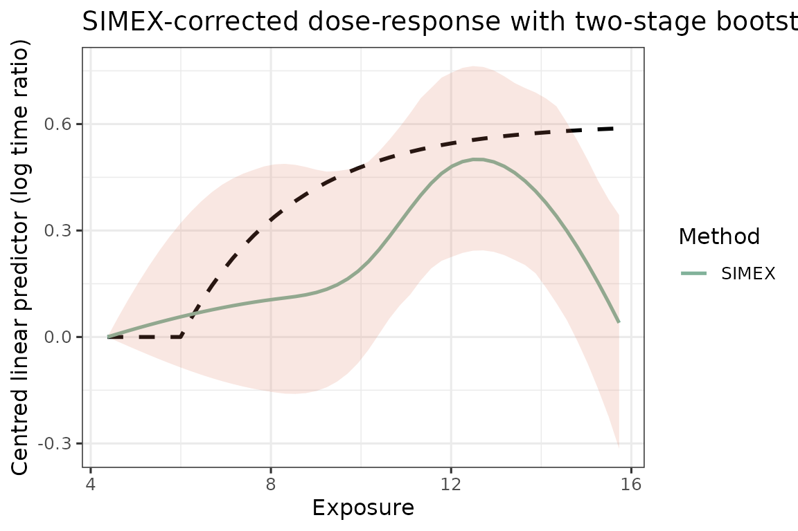

# Quick start: AFT + spline + SIMEX

This vignette walks through one end-to-end fit on simulated data. The
intended workflow on real data is the same four-stage pipeline:

1.  **Phase-1 calibration** of the measurement-error model on a small
    validation sample where both the truth `X` and the surrogates
    `W_1, ..., W_J` are observed.
2.  **GLS combination** of the surrogates on the main study into a
    single calibrated exposure `W_bar` with a known conditional
    variance.
3.  **SIMEX correction** of an AFT-spline dose-response fitted on
    `W_bar`, which extrapolates back to the zero-error fit.
4.  **Two-stage bootstrap** that resamples both the validation sample
    and the main study, so the resulting confidence band reflects
    uncertainty from *both* phases.

``` r

library(aftsplex)
```

## Simulate

[`generate_aft_data()`](https://qihuangzhang.github.io/aftsplex/reference/generate_aft_data.md)
returns a list with a main-study survival data frame, a small validation
data frame, and the truth used to generate them. The main study has a
latent exposure `X_true` that is *not* observed in practice; only the
three noisy surrogates `W1, W2, W3` are.

``` r

sim <- generate_aft_data(n = 1000, n_val = 300, seed = 1)
head(sim$survival, 3)
#>      T_obs delta    X_true       W1       W2       W3       V1       V2 V3 V4
#> 1 262.2179     1  8.599207 11.44018 10.64514 7.314311 35.67483 25.56925  0  1
#> 2 706.4496     0 10.410639 10.06811 11.15140 7.532874 35.55966 20.38873  1  1
#> 3 259.9447     1  8.131478 10.02983  8.43953 9.722204 25.64611 38.09850  1  1
```

## Phase-1 calibration

[`fit_me_calibration()`](https://qihuangzhang.github.io/aftsplex/reference/fit_me_calibration.md)
estimates the classical multivariate measurement-error model

``` math
 W_j = \alpha_{0j} + \alpha_{1j}\, X + e_j, \qquad e \sim \mathcal N_J(0, \Sigma_e), 
```

on the validation sample, returning per-surrogate intercepts and slopes
together with the residual covariance `Sigma_e`. The slope `alpha1` near
1 indicates an essentially unbiased surrogate; departures from 1 flag
scale shift that the GLS step will correct.

``` r

cal <- fit_me_calibration(sim$validation)
cal$alpha1                # close to 1: surrogates are essentially unbiased
#> [1] 0.9591900 0.9580766 0.8901528
round(cal$Sigma_e, 2)     # error covariance across the three surrogates
#>      [,1] [,2] [,3]
#> [1,] 1.77 0.88 1.06
#> [2,] 0.88 2.28 1.05
#> [3,] 1.06 1.05 3.15
```

[`gls_combine()`](https://qihuangzhang.github.io/aftsplex/reference/gls_combine.md)
applies the per-surrogate back-transform
`W_tilde_j = (W_j - alpha_{0j}) / alpha_{1j}` and then collapses the
back-transformed surrogates with the GLS weights
`omega = Sigma_tilde^{-1} 1 / (1' Sigma_tilde^{-1} 1)`. The combined
exposure `W_bar` is the minimum-variance linear unbiased estimator of
`X` available from the surrogates, and its conditional variance
`sigma_w_sq` is the residual ME variance that SIMEX needs in the next
step.

``` r

W <- as.matrix(sim$survival[, cal$W_cols])
g <- gls_combine(W, cal)
dat <- sim$survival
dat$W_bar <- g$W_bar
round(g$sigma_w_sq, 3)    # residual ME variance fed to SIMEX
#> [1] 1.517
```

## SIMEX point estimate

SIMEX (simulation-extrapolation) corrects the bias that arises from
fitting the AFT-spline on the noisy `W_bar` instead of the unobserved
`X`. For each value of `lambda` it adds extra Gaussian noise with
variance `lambda * sigma_w_sq` to `W_bar`, refits the dose-response `B`
times, and finally extrapolates the per-`lambda` curves back to
`lambda = -1` (the zero-error case). Key knobs:

- **`lambda`** — the perturbation grid. A typical choice is
  `c(0.5, 1, 1.5, 2)`; including more values gives a more stable
  quadratic extrapolation.
- **`B`** — the number of Monte-Carlo perturbations *per* `lambda`.
  Small `B` (say `10`–`20`) is enough for a quick look but visibly
  noisy; `B = 100` is the practical floor for a publication-quality
  point estimate.
- **`v_ref`** — the reference values of the adjustment covariates at
  which the dose-response is reported (the curve is invariant to this
  choice up to a vertical shift, which we remove below by anchoring at
  the first grid point).

``` r

x_grid <- seq(quantile(g$W_bar, 0.02),
              quantile(g$W_bar, 0.98), length.out = 50)

s <- simex_aft_spline(
  dat, x_var = "W_bar", sigma_w_sq = g$sigma_w_sq,
  covariates = c("V1","V2","V3","V4"),
  v_ref = c(V1 = 30, V2 = 30, V3 = 0, V4 = 0),
  lambda = c(0.5, 1, 1.5, 2), B = 100,
  x_grid = x_grid
)
```

## Two-stage bootstrap interval

A naive bootstrap of the main study alone underestimates uncertainty
because it ignores the variability in the Phase-1 calibration. The
[`two_stage_bootstrap()`](https://qihuangzhang.github.io/aftsplex/reference/two_stage_bootstrap.md)
wraps the full pipeline above — resample the validation set, refit
[`fit_me_calibration()`](https://qihuangzhang.github.io/aftsplex/reference/fit_me_calibration.md),
resample the main study, recompute `W_bar` and `sigma_w_sq`, then refit
[`simex_aft_spline()`](https://qihuangzhang.github.io/aftsplex/reference/simex_aft_spline.md)
— so the resulting pointwise interval propagates *both* sources of
sampling variation. Key knobs:

- **`R`** — the number of outer (validation + main) bootstrap
  replicates. Each replicate runs a complete SIMEX pipeline, so this is
  the dominant cost. `R = 200` is a sensible default for real-data
  reporting; we use `R = 50` here for build time.
- **`B`** — the SIMEX Monte-Carlo size *inside* each bootstrap
  replicate. Because the outer replicates already average over Monte
  Carlo noise, a moderate inner `B` (20–50) is typically sufficient even
  when the headline point estimate uses `B = 100`.
- **`lambda`** — must match the grid used for the point estimate, so
  that the bootstrap interval is centred on the same extrapolation
  scheme.

``` r

set.seed(1)
boot <- two_stage_bootstrap(
  survival   = sim$survival,
  validation = sim$validation,
  x_var      = "X_true",                # truth column for calibration
  covariates = c("V1","V2","V3","V4"),
  v_ref      = c(V1 = 30, V2 = 30, V3 = 0, V4 = 0),
  lambda     = c(0.5, 1, 1.5, 2), B = 30, R = 50,
  x_grid     = x_grid,
  verbose    = FALSE
)
```

## Plot

``` r

truth <- f_true(x_grid) - f_true(x_grid[1])
fits  <- list(SIMEX = boot$f_hat)
plot_curves(x_grid, truth, fits,
            ci = list(lower = boot$lower, upper = boot$upper),
            title = "SIMEX-corrected dose-response with two-stage bootstrap CI")
```


