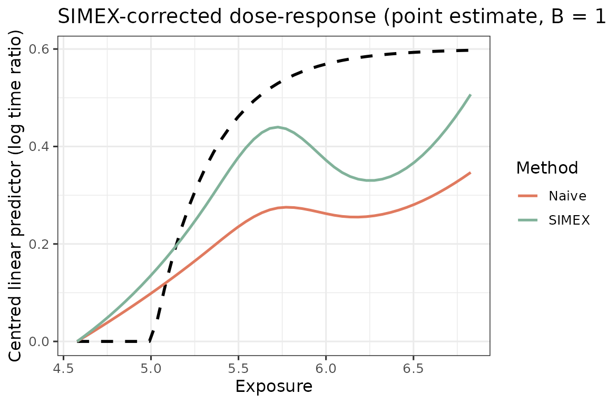

# Quick start: AFT + spline + SIMEX

This vignette walks through one end-to-end fit on simulated data. The
intended workflow on real data is the same four-stage pipeline:

1.  **Phase-1: Parameter estimation** of the measurement-error model on
    a small validation sample where both the truth `X` and the
    surrogates `W_1, ..., W_J` are observed.
2.  **Phase-1: GLS aggregation** of the surrogates on the main study
    into a single calibrated exposure `W_bar` with a known conditional
    variance.
3.  **Phase-2: SIMEX correction** of an AFT-spline dose-response fitted
    on `W_bar`, which extrapolates back to the zero-error fit.
4.  **Phase-2:Two-stage bootstrap** that resamples both the validation
    sample and the main study, so the resulting confidence band reflects
    uncertainty from *both* phases.

``` r

library(aftsplex)
```

## Simulate

[`generate_aft_data()`](https://qihuangzhang.github.io/aftsplex/reference/generate_aft_data.md)
returns a list with a main-study survival data frame, a small validation
data frame, and the truth used to generate them. The main study has a
latent exposure `X_true` that is *not* observed in practice; only the
three noisy surrogates `W1, W2, W3` are.

We put the exposure on the manuscript’s **daily-LPA log scale**:
`X_true` is `log(LPA minutes)` with mean `log(300)` (about 300 min/day)
and `sd = 0.45` (95% roughly in \[124, 725\] min), and the dose-response
threshold sits at `log(150)`. See
[`vignette("applied-lpa")`](https://qihuangzhang.github.io/aftsplex/articles/applied-lpa.md)
for displaying the fit back on the minute / time-ratio scale.

``` r

XM <- log(300); XS <- 0.45            # ~300 min/day on the log analysis scale
FA <- list(x_min = log(150), alpha = 3.0, beta = 0.6)
Su <- sigma_u_for_reliability(0.5, var_x = XS^2)   # ME calibrated on the log scale
sim <- generate_aft_data(n = 1000, n_val = 300, Sigma_u = Su,
                         x_mean = XM, x_sd = XS, f_args = FA, seed = 2026)
head(sim$survival, 3)
#>      T_obs delta   X_true       W1       W2       W3       V1       V2 V3 V4
#> 1 826.9194     0 5.938048 6.174898 5.398352 5.955575 38.85282 30.99448  1  1
#> 2 414.1523     1 5.217922 4.761600 4.888005 5.277572 34.50189 30.82174  1  1
#> 3 879.5703     0 5.766440 5.330563 5.769608 5.382103 36.65207 30.40219  1  1
```

## Phase-1: Parameter estimation and surrogates aggregation

[`fit_me_calibration()`](https://qihuangzhang.github.io/aftsplex/reference/fit_me_calibration.md)
estimates the classical multivariate measurement-error model

``` math
 W_j = \alpha_{0j} + \alpha_{1j}\, X + e_j, \qquad e \sim \mathcal N_J(0, \Sigma_e), 
```

on the validation sample, returning per-surrogate intercepts and slopes
together with the residual covariance `Sigma_e`. The slope `alpha1` near
1 indicates an essentially unbiased surrogate; departures from 1 flag
scale shift that the GLS step will correct.

``` r

cal <- fit_me_calibration(sim$validation)
cal$alpha1                # close to 1: surrogates are essentially unbiased
#> [1] 0.9772198 1.0740693 1.0257921
round(cal$Sigma_e, 2)     # error covariance across the three surrogates
#>      [,1] [,2] [,3]
#> [1,] 0.16 0.07 0.08
#> [2,] 0.07 0.17 0.09
#> [3,] 0.08 0.09 0.26
```

[`gls_combine()`](https://qihuangzhang.github.io/aftsplex/reference/gls_combine.md)
applies the per-surrogate back-transform
`W_tilde_j = (W_j - alpha_{0j}) / alpha_{1j}` and then collapses the
back-transformed surrogates with the GLS weights
`omega = Sigma_tilde^{-1} 1 / (1' Sigma_tilde^{-1} 1)`. The combined
exposure `W_bar` is the minimum-variance linear unbiased estimator of
`X` available from the surrogates, and its conditional variance
`sigma_w_sq` is the residual ME variance that SIMEX needs in the next
step.

``` r

W <- as.matrix(sim$survival[, cal$W_cols])
g <- gls_combine(W, cal)
dat <- sim$survival
dat$W_bar <- g$W_bar
round(g$sigma_w_sq, 3)    # residual ME variance fed to SIMEX
#> [1] 0.106
```

## Phase-2: SIMEX point estimate

SIMEX (simulation-extrapolation) corrects the bias that arises from
fitting the AFT-spline on the noisy `W_bar` instead of the unobserved
`X`. For each value of `lambda` it adds extra Gaussian noise with
variance `lambda * sigma_w_sq` to `W_bar`, refits the dose-response `B`
times, and finally extrapolates the per-`lambda` curves back to
`lambda = -1` (the zero-error case). Key knobs:

- **`lambda`** — the perturbation grid. A typical choice is
  `c(0.5, 1, 1.5, 2)`; including more values gives a more stable
  quadratic extrapolation.
- **`B`** — the number of Monte-Carlo perturbations *per* `lambda`.
  Small `B` (say `10`–`20`) is enough for a quick look but visibly
  noisy; `B = 100` is the practical floor for a publication-quality
  point estimate.
- **`v_ref`** — the reference values of the adjustment covariates at
  which the dose-response is reported (the curve is invariant to this
  choice up to a vertical shift, which we remove below by anchoring at
  the first grid point).

``` r

x_grid <- seq(quantile(g$W_bar, 0.02),
              quantile(g$W_bar, 0.98), length.out = 50)

s <- simex_aft_spline(
  dat, x_var = "W_bar", sigma_w_sq = g$sigma_w_sq,
  covariates = c("V1","V2","V3","V4"),
  v_ref = c(V1 = 30, V2 = 30, V3 = 0, V4 = 0),
  lambda = c(0.5, 1, 1.5, 2), B = 100,
  x_grid = x_grid
)
```

[`summary()`](https://rdrr.io/r/base/summary.html) reports the
configuration of the fit alongside the SIMEX-corrected dose-response at
quantiles of the exposure grid, with the naive curve as a smoothing-bias
reference. The `Correction` row quantifies how much SIMEX shifts the
naive curve at each exposure quantile – larger magnitude indicates more
residual ME attenuation that the correction is undoing.

``` r

summary(s)
#> SIMEX-corrected AFT-spline dose-response
#> 
#> Call:
#>   simex_aft_spline(data = dat, x_var = "W_bar", sigma_w_sq = g$sigma_w_sq, 
#>     covariates = c("V1", "V2", "V3", "V4"), v_ref = c(V1 = 30, 
#>         V2 = 30, V3 = 0, V4 = 0), lambda = c(0.5, 1, 1.5, 2), 
#>     B = 100, x_grid = x_grid)
#> 
#> Configuration:
#>   n observations:  1000               Spline df:    4
#>   Covariates:      V1, V2, V3, V4     Distribution: lognormal
#>   Lambda grid:     0.0, 0.5, 1.0, 1.5, 2.0
#>   Inner B:         100                sigma_w_sq:   0.1063
#> 
#> Centred dose-response (anchored at min(x_grid)):
#>               5%   25%   50%   75%   95%
#> x          4.690 5.140 5.702 6.265 6.715
#> Naive      0.025 0.135 0.272 0.257 0.320
#> SIMEX      0.031 0.195 0.438 0.330 0.449
#> Correction 0.006 0.060 0.166 0.073 0.128
```

A bare [`plot()`](https://rdrr.io/r/graphics/plot.default.html) on the
SIMEX object draws the corrected curve with the naive curve overlaid
(the smoothing-bias reference). Because we are on simulated data we can
also pass `truth` to overlay the data-generating curve as a dashed line;
on real data simply omit it.

``` r

f_d   <- function(x) do.call(f_true, c(list(x), FA))
truth <- f_d(x_grid) - f_d(x_grid[1])
plot(s, truth = truth,
     title = "SIMEX-corrected dose-response (point estimate, B = 100)")
```



## Phase-2: Uncertainty quantification with two-stage bootstrap

A naive bootstrap of the main study alone underestimates uncertainty
because it ignores the variability in the Phase-1 calibration. The
[`two_stage_bootstrap()`](https://qihuangzhang.github.io/aftsplex/reference/two_stage_bootstrap.md)
wraps the full pipeline above — resample the validation set, refit
[`fit_me_calibration()`](https://qihuangzhang.github.io/aftsplex/reference/fit_me_calibration.md),
resample the main study, recompute `W_bar` and `sigma_w_sq`, then refit
[`simex_aft_spline()`](https://qihuangzhang.github.io/aftsplex/reference/simex_aft_spline.md)
— so the resulting pointwise interval propagates *both* sources of
sampling variation. Key knobs:

- **`R`** — the number of outer (validation + main) bootstrap
  replicates. Each replicate runs a complete SIMEX pipeline, so this is
  the dominant cost. `R = 200` is a sensible default for real-data
  reporting; we use `R = 50` here for build time.
- **`B`** — the SIMEX Monte-Carlo size *inside* each bootstrap
  replicate. Because the outer replicates already average over Monte
  Carlo noise, a moderate inner `B` (20–50) is typically sufficient even
  when the headline point estimate uses `B = 100`.
- **`lambda`** — must match the grid used for the point estimate, so
  that the bootstrap interval is centred on the same extrapolation
  scheme.

``` r

set.seed(2026)
boot <- two_stage_bootstrap(
  survival   = sim$survival,
  validation = sim$validation,
  x_var      = "X_true",                # truth column for calibration
  covariates = c("V1","V2","V3","V4"),
  v_ref      = c(V1 = 30, V2 = 30, V3 = 0, V4 = 0),
  lambda     = c(0.5, 1, 1.5, 2), B = 30, R = 50,
  x_grid     = x_grid,
  verbose    = FALSE
)
```

Calling [`summary()`](https://rdrr.io/r/base/summary.html) on the
returned object reports the replicate yield, the exposure grid and
anchor, the Phase-1 `sigma_w_sq` spread across the bootstrap
calibrations, and the corrected curve with its 95% percentile interval
at quantiles of the exposure grid:

``` r

summary(boot)
#> Two-stage bootstrap SIMEX-corrected dose-response
#> 
#> Configuration:
#>   Replicates:      50 of 50 effective   Grid points: 50
#>   Exposure range:  [4.578, 6.827]
#>   Anchored at:     first grid point (x = 4.578)
#>   sigma_w_sq:      mean 0.1049 (range 0.0812-0.1299, 50 calibrations)
#> 
#> Corrected curve with 95% percentile CI (log time ratio):
#>           5%    25%   50%    75%   95%
#> x      4.690  5.140 5.702  6.265 6.715
#> SIMEX  0.027  0.184 0.443  0.354 0.460
#> lower -0.109 -0.302 0.032 -0.066 0.026
#> upper  0.124  0.517 0.661  0.593 0.772
```

## Plot with the bootstrap confidence band

The [`plot()`](https://rdrr.io/r/graphics/plot.default.html) method on
the SIMEX object accepts a `ci` argument with `lower` and `upper`
elements, so we can overlay the bootstrap percentile ribbon directly.
The point estimate `s$curve_simex` and the bootstrap `boot$f_hat` are
essentially identical (both are single SIMEX runs on the full sample,
differing only by RNG state); we plot `s` here to keep the example
self-contained.

``` r

plot(s, truth = truth,
     ci = list(lower = boot$lower, upper = boot$upper),
     title = "SIMEX-corrected dose-response with two-stage bootstrap CI")
```


## Where to next

This vignette reports the fit on the internal log scale (the AFT
analysis axis). For the applied presentation – the **time-acceleration
ratio** against LPA in **minutes**, anchored at a clinical reference of
200 min/day, with the lower-support caveat – see
[`vignette("applied-lpa")`](https://qihuangzhang.github.io/aftsplex/articles/applied-lpa.md).
For parallel execution of the bootstrap, see
`two_stage_bootstrap(..., workers = 4)` and the note in
[`vignette("faq")`](https://qihuangzhang.github.io/aftsplex/articles/faq.md).
