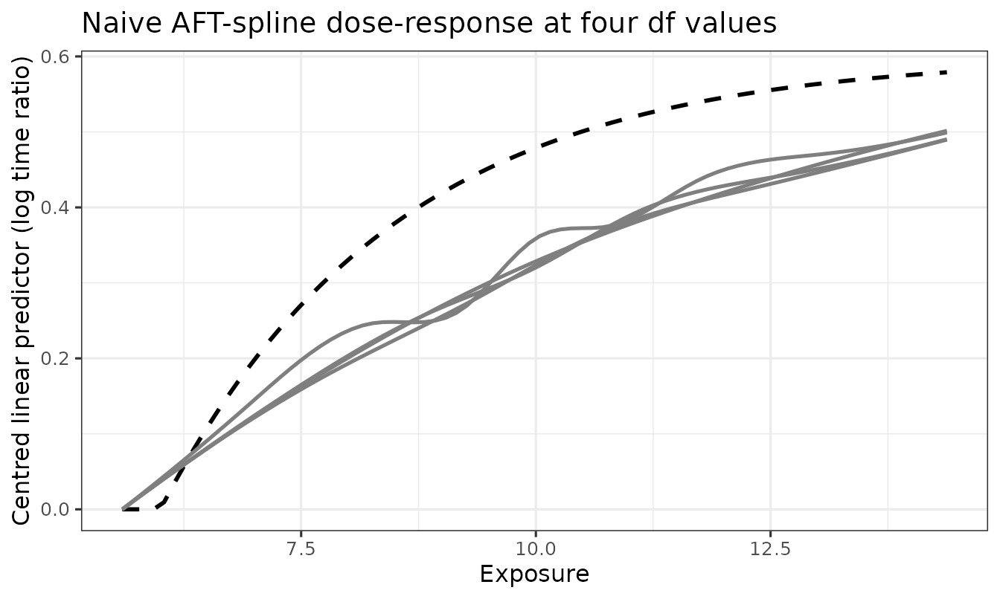
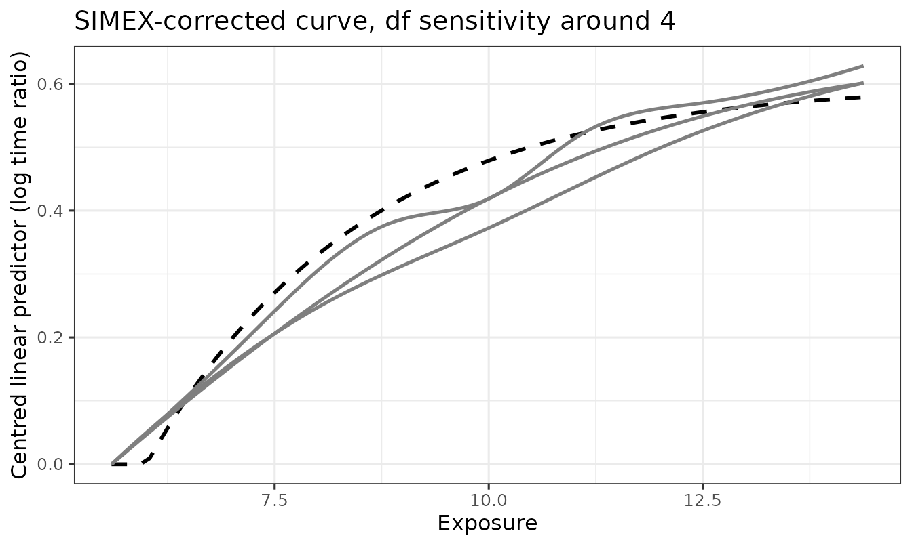

# Sensitivity analysis: spline degrees of freedom

The spline degrees of freedom `df` controls how flexibly the fitted
dose-response curve can bend. It is the single most consequential tuning
knob in this package: too low and the curve will be biased in regions
where the true dose-response changes rapidly; too high and the curve
will overfit noise and inflate variance.

This vignette walks through three concrete recommendations:

1.  **Inspect the curve shape** across a small grid of `df` values.
2.  **Use AIC** to pick a single `df` for the headline result.
3.  **Report the sensitivity range** across neighbouring `df` values
    alongside the headline.

These steps apply equally to a naive AFT-spline fit, an SIMEX-corrected
fit, or a two-stage bootstrap.

``` r

library(aftsplex)
```

## Set up

We use one simulated replicate to keep the runtime small. On real data
substitute your cleaned survival data frame and validation sample.

``` r

sim <- generate_aft_data(n = 2000, n_val = 500, seed = 1)

cal <- fit_me_calibration(sim$validation)
W   <- as.matrix(sim$survival[, cal$W_cols])
g   <- gls_combine(W, cal)
dat <- sim$survival
dat$W_bar <- g$W_bar

V_REF  <- c(V1 = 30, V2 = 30, V3 = 0, V4 = 0)
x_grid <- seq(quantile(dat$W_bar, 0.05),
              quantile(dat$W_bar, 0.95), length.out = 80)
truth  <- f_true(x_grid) - f_true(x_grid[1])
```

## 1. Inspect the curve shape across `df`

We fit a naive AFT-spline (the simplest, fastest estimator) at four
values of `df`. The naive fit is biased by measurement error in `W_bar`,
but it isolates the *smoothing* contribution of `df` — which is what we
want to understand here. The same df-sensitivity logic carries over to
the SIMEX-corrected fit because higher `df` reduces smoothing bias for
*every* spline-based estimator.

``` r

df_grid <- c(4, 5, 6, 8)
fits <- lapply(df_grid, function(d) {
  fit_aft_spline(dat, x_var = "W_bar",
                 covariates = names(V_REF), df = d)
})
names(fits) <- paste0("df=", df_grid)

curves <- lapply(fits, function(f) {
  lp <- predict_curve(f, x_grid, v_ref = V_REF, x_var = "W_bar")
  lp - lp[1]
})
```

``` r

plot_curves(x_grid, truth, fits = curves,
            title = "Naive AFT-spline dose-response at four df values")
#> Warning: No shared levels found between `names(values)` of the manual scale and the
#> data's colour values.
#> No shared levels found between `names(values)` of the manual scale and the
#> data's colour values.
```



**What to look for:**

- At `df = 4` the curve cannot fully capture the steep low-`W_bar`
  segment of the true function. It is the most biased but the smoothest.
- At `df = 8` the curve hugs the data more closely but begins to show
  wiggle artefacts.
- The middle values (`df = 5, 6`) tend to be the practical compromise on
  this dataset.

## 2. AIC for an automatic choice

`survreg()` reports a log-likelihood. We compute AIC manually and pick
the minimiser.

``` r

aic_table <- data.frame(
  df  = df_grid,
  k   = sapply(fits, function(f) length(coef(f)) + 1L),  # +1 for log-scale
  logLik = sapply(fits, function(f) as.numeric(logLik(f))),
  AIC = sapply(fits, function(f) AIC(f))
)
aic_table
#>      df  k    logLik      AIC
#> df=4  4 10 -11001.96 22023.93
#> df=5  5 11 -11001.91 22025.82
#> df=6  6 12 -11001.88 22027.77
#> df=8  8 14 -11001.63 22031.27
df_star <- df_grid[which.min(aic_table$AIC)]
df_star
#> [1] 4
```

`df_star` is the AIC-minimising spline df — the value we would use for
the headline dose-response figure on real data.

## 3. Reporting a sensitivity range

A defensible reporting strategy in the manuscript is:

> *“The headline dose-response is shown at `df = df_star`
> (AIC-minimising across `df ∈ {4, 5, 6, 8}`). Conclusions are unchanged
> across this range; see Supplementary Figure X for sensitivity.”*

We can plot the SIMEX-corrected curve at, say, `df_star`, alongside
`df_star ± 2`, to show that the substantive shape of the curve is
robust. This is more expensive than the naive fits above because each
SIMEX call runs the full perturb-refit-extrapolate pipeline, but the
result is much more informative for a reviewer.

``` r

df_show <- sort(unique(pmax(2, c(df_star - 2, df_star, df_star + 2))))

set.seed(2026)
simex_curves <- lapply(df_show, function(d) {
  s <- simex_aft_spline(
    dat, x_var = "W_bar", sigma_w_sq = g$sigma_w_sq,
    covariates = names(V_REF), v_ref = V_REF,
    lambda = c(0.5, 1, 1.5, 2), B = 30,
    df = d, x_grid = x_grid
  )
  s$curve_simex
})
names(simex_curves) <- paste0("df=", df_show)

plot_curves(x_grid, truth, fits = simex_curves,
            title = paste0("SIMEX-corrected curve, df sensitivity around ",
                           df_star))
#> Warning: No shared levels found between `names(values)` of the manual scale and the
#> data's colour values.
#> No shared levels found between `names(values)` of the manual scale and the
#> data's colour values.
```



If these three curves agree on the qualitative dose-response shape —
where it rises, where it plateaus, where it is monotone — the
substantive claim is robust to `df`. If they disagree (e.g., a peak
appears at `df = df_star + 2` but not at `df_star`), that disagreement
should be reported and the manuscript framing softened accordingly.

## Practical recommendations

- **Start with `df ∈ {4, 5, 6, 8}`**. This range is wide enough to
  reveal smoothing bias but narrow enough to keep the substantive shape
  comparable.
- **Headline at AIC-min**. AIC is not perfect, but it is reproducible
  and pre-specifiable.
- **Always report a sensitivity range** in the appendix.
- **Avoid `df = 3`** unless the dose-response is genuinely close to
  linear; the basis is too rigid to capture realistic biological
  curvature.
- **Avoid `df > 10`** without penalisation; `survreg()` has no spline
  penalty, so high-df unpenalised fits will wiggle. If you need that
  flexibility, switch to a penalised spline via
  [`mgcv::gam()`](https://rdrr.io/pkg/mgcv/man/gam.html). (Future
  versions of `aftsplex` may add an mgcv backend.)

## Related vignettes

- [`vignette("quickstart")`](https://qihuangzhang.github.io/aftsplex/articles/quickstart.md)
  — the full Phase 1 + Phase 2 + bootstrap pipeline at a single fixed
  `df = 4`.
- [`vignette("simulation-study")`](https://qihuangzhang.github.io/aftsplex/articles/simulation-study.md)
  — Monte Carlo bias and ISE of the three estimators at the default
  `df = 4`.
