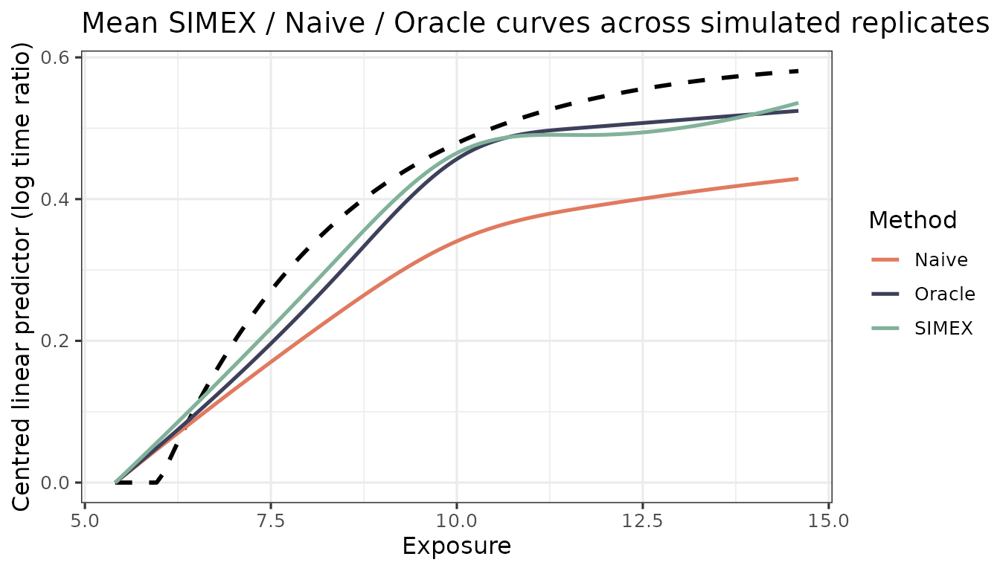

# Simulation study: Oracle vs Naive vs SIMEX

A small Monte Carlo replicating the structure of the manuscript appendix
simulation. Three estimators are compared on the same `r` replicates:

- **Oracle** – fits on the true latent exposure `X_true` (an upper
  bound).
- **Naive** – fits on the GLS-combined surrogate `W_bar` without ME
  correction.
- **SIMEX** – fits on `W_bar` with the SIMEX correction.

The vignette uses `N_REP = 20` replicates so it builds in under a
minute; the manuscript figure uses 500. Set `N_REP` higher locally to
reproduce.

``` r

library(aftsplex)

N_REP   <- 20L
N       <- 1500
N_VAL   <- 400
B_INNER <- 10
DF      <- 4
LAMBDA  <- c(0.5, 1, 1.5, 2)

x_grid <- seq(qnorm(0.02, 10, sqrt(5)),
              qnorm(0.98, 10, sqrt(5)),
              length.out = 100)
truth  <- f_true(x_grid) - f_true(x_grid[1])
V_REF  <- c(V1 = 30, V2 = 30, V3 = 0, V4 = 0)
```

## Single-replicate driver

``` r

run_one <- function(seed) {
  sim <- generate_aft_data(n = N, n_val = N_VAL, seed = seed)
  cal <- fit_me_calibration(sim$validation)
  W   <- as.matrix(sim$survival[, cal$W_cols])
  g   <- gls_combine(W, cal)
  dat <- sim$survival
  dat$W_bar <- g$W_bar

  fit_oracle <- fit_aft_spline(dat, "X_true",
                               covariates = names(V_REF), df = DF)
  fit_naive  <- fit_aft_spline(dat, "W_bar",
                               covariates = names(V_REF), df = DF)
  lp_oracle <- predict_curve(fit_oracle, x_grid, V_REF, "X_true")
  lp_naive  <- predict_curve(fit_naive,  x_grid, V_REF, "W_bar")

  s <- simex_aft_spline(dat, x_var = "W_bar",
                        sigma_w_sq = g$sigma_w_sq,
                        covariates = names(V_REF), v_ref = V_REF,
                        lambda = LAMBDA, B = B_INNER,
                        x_grid = x_grid)
  list(Oracle = lp_oracle - lp_oracle[1],
       Naive  = lp_naive  - lp_naive[1],
       SIMEX  = s$curve_simex)
}
```

## Run the Monte Carlo

``` r

t0 <- Sys.time()
res <- lapply(seq_len(N_REP), function(i) run_one(20260601L + i))
elapsed <- Sys.time() - t0
```

``` r

elapsed
#> Time difference of 15.58071 secs
```

## ISE summary

``` r

methods <- c("Oracle", "Naive", "SIMEX")
ise_mat <- sapply(res, function(r)
  vapply(methods, function(m) {
    e <- r[[m]] - truth
    delta_x <- diff(x_grid)
    sum(((e[-1] + e[-length(e)])^2 / 4) * delta_x)
  }, numeric(1))
)
rownames(ise_mat) <- methods
data.frame(
  Mean   = round(rowMeans(ise_mat), 3),
  MCSE   = round(apply(ise_mat, 1, sd) / sqrt(N_REP), 4),
  Median = round(apply(ise_mat, 1, median), 3)
)
#>         Mean   MCSE Median
#> Oracle 0.065 0.0108  0.043
#> Naive  0.181 0.0254  0.140
#> SIMEX  0.084 0.0162  0.057
```

The pattern matches the manuscript: Naive carries 2-3x the ISE of Oracle
(attenuation), and SIMEX recovers most of that gap.

## Mean curves

``` r

mean_curve <- function(m) rowMeans(sapply(res, function(r) r[[m]]))
fits <- setNames(lapply(methods, mean_curve), methods)
plot_curves(x_grid, truth, fits,
            title = "Mean SIMEX / Naive / Oracle curves across simulated replicates")
```


